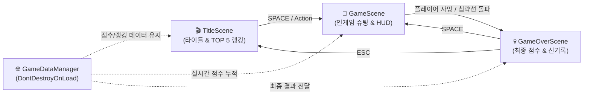

# 👾 Star Invader (Unity 6 2D Space Shooter)

<div align="center">

-blue.svg?style=for-the-badge&logo=unity)


<br>

**클래식 아케이드 감성의 스페이스 인베이더를 현대적인 Unity 6 컴포넌트 기반 아키텍처로 재해석한 2D 레트로 슈팅 게임입니다.**

</div>

---

## 👨‍💻 Developer Information

<div align="center">

| 항목 | 정보 |
| :--- | :--- |
| **Name** | **Baekjin Sung (성백진)** |
| **Role** | Passionate Software Engineer |
| **Email** | [sbjwin4271@gmail.com](mailto:sbjwin4271@gmail.com) |
| **GitHub** | [@sbjwin](https://github.com/sbjwin) |

</div>

---

## 🎮 게임 소개 (Game Overview)

**Star Invader**는 지구를 침략하려는 외계 편대(Alien Fleet)의 공습을 저지하는 클래식 2D 아케이드 슈팅 게임입니다. 

* **동기화된 적 편대 AI:** 3행 × 8열(총 24기)의 적들이 좌우로 이동하며 벽에 부딪힐 때마다 하강합니다. 적 기체가 파괴될수록 편대 이동 속도가 가속됩니다.
* **최하단 적의 탄환 반격:** 각 열의 최하단에 위치한 적들이 주기적으로 레이저 탄환을 발사합니다.
* **플레이어 라이프 & 무적 연출:** 시작 목숨 3개가 주어지며, 피격 시 화면 진동(`CameraShake`)과 1.2초간의 무적 깜빡임 연출이 발동됩니다.
* **절차적 신스 사운드 시스템:** 오디오 에셋 누락 시에도 실시간 절차적 알고리즘으로 신스 폭발음을 합성하여 재생합니다.
* **로컬 JSON 랭킹 시스템:** 게임오버 시 최고 기록을 갱신하고 상위 TOP 5 점수를 로컬 JSON 파일에 영구 보존합니다.

---

## 🕹️ 조작 방법 (Controls)

> **Unity 6 최신 New Input System 및 레거시 입력을 모두 완벽 지원합니다.**

| 키 (Key) | 기능 (Action) |
| :--- | :--- |
| **`A` / `D`** 또는 **`←` / `→`** | 플레이어 비행선 좌우 이동 |
| **`Space`** 또는 **`Enter`** | 타이틀 시작 / 레이저 탄환 발사 / 게임오버 시 재시작 |
| **`R`** | 타이틀 화면에서 TOP 5 랭킹 모달 열기 |
| **`ESC`** | 랭킹 창 닫기 / 게임오버 화면에서 타이틀 씬 복귀 |

---

## 🏗️ 씬 구조 및 아키텍처 (Multi-Scene Architecture)

단일 씬의 단순 활성/비활성화 한계를 탈피하고, **책임 분리와 수명주기 관리가 명확한 유니티 표준 3단 멀티 씬 구조**로 설계되었습니다.



### 주요 씬별 역할
1. **`TitleScene.unity`**: 네온 타이틀 로고, 시작 안내, 로컬 TOP 5 랭킹 팝업 모달
2. **`GameScene.unity`**: 플레이어 이동/사격, 24기 적 편대 알고리즘, 실시간 HUD(Score, High-Score, Lives)
3. **`GameOverScene.unity`**: 최종 점수, 신기록(★ NEW RECORD! ★) 판정, 원클릭 재도전

---

## 🚀 빠른 시작 및 테스트 가이드 (How to Clone & Run)

### 1. 레포지토리 클론
터미널 또는 Git Bash에서 아래 명령어를 실행합니다.

```bash
git clone https://github.com/sbjwin/StarInvader.git
```

### 2. Unity Hub에서 프로젝트 열기
1. **Unity Hub**를 실행합니다.
2. 우측 상단의 **[열기(Open)]** ➡️ **[디스크에서 프로젝트 추가(Add project from disk)]**를 클릭합니다.
3. 클론한 `StarInvader` 폴더를 선택합니다.
4. **권장 에디터 버전:** `Unity 6 (6000.3.22f1)` 이상

### 3. 게임 실행
1. Unity Project 창에서 **`Assets/Scenes/TitleScene.unity`**를 더블 클릭하여 엽니다.
2. 유니티 상단 가운데의 **`▶ (Play)`** 버튼을 누릅니다.
3. **`Space`** 키를 눌러 게임을 시작합니다!

---

## 📁 프로젝트 폴더 구조

```text
StarInvader/
├── Assets/
│   ├── GameAssets/          # 스프라이트 이미지, 폰트, SFX 오디오
│   │   ├── images/
│   │   └── sounds/
│   ├── Prefabs/             # 플레이어/적 탄환, 폭발 이펙트, 적 기체 프리팹
│   ├── Scenes/              # 3단 멀티 씬
│   │   ├── TitleScene.unity
│   │   ├── GameScene.unity
│   │   └── GameOverScene.unity
│   └── Scripts/             # 핵심 C# 스크립트
│       ├── BackgroundScroller.cs  # 우주 배경 무한 스크롤
│       ├── Bullet.cs              # 탄환 충돌 및 이동 (Kinematic Rigidbody2D)
│       ├── CameraShake.cs         # 피격 시 카메라 진동 연출
│       ├── Enemy.cs               # 개별 적 기체 피격/폭발
│       ├── EnemyFleet.cs          # 24기 편대 제어 & 사격 AI
│       ├── GameConstants.cs       # 게임 밸런스 상수 정의
│       ├── GameDataManager.cs     # 글로벌 싱글톤 점수/랭킹 매니저
│       ├── GameOverController.cs  # 게임오버 씬 제어
│       ├── InGameController.cs    # 인게임 HUD 및 루프 제어
│       ├── InputHelper.cs         # New/Old Input System 크로스 플랫폼 헬퍼
│       ├── PlayerController.cs    # 플레이어 이동, 사격, 무적 코루틴
│       ├── SoundManager.cs        # SFX 및 절차적 신스 오디오 매니저
│       └── TitleController.cs     # 타이틀 씬 및 랭킹 모달 제어
└── README.md
```

---

## 📜 라이선스 (License)

This project is licensed under the MIT License - see the [LICENSE](LICENSE) file for details.
