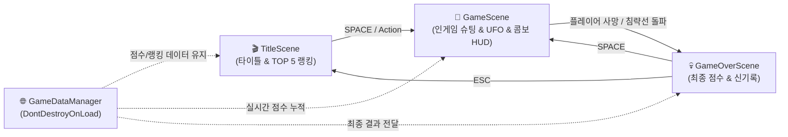

# 👾 Star Invader (Unity 6 2D Space Shooter)

<div align="center">

-blue.svg?style=for-the-badge&logo=unity)


<br>

**클래식 아케이드 감성의 스페이스 인베이더와 갤러그의 정수를 결합하여 현대적인 Unity 6 컴포넌트 아키텍처와 절차적 신스 오디오로 완성한 2D 레트로 슈팅 게임입니다.**

</div>

---

## 👨‍💻 Developer Information

- **Name:** Sung Baekjin (성백진)
- **Role:** Passionate Game & Software Engineer
- **Email:** [sbjwin4271@gmail.com](mailto:sbjwin4271@gmail.com)
- **GitHub:** [@sbjwin](https://github.com/sbjwin)

---

## 🎮 게임 주요 특징 (v0.5 Key Features)

**Star Invader**는 지구를 침략하려는 외계 편대(Alien Fleet)와 미스터리 모함의 공습을 저지하는 클래식 2D 아케이드 슈팅 게임입니다.

* **🖥️ 16:9 PC 아케이드 3분할 윙(Side Wings) 캐비닛 화면:**
  - 현대적 16:9 PC 모니터에 최적화된 아케이드 캐비닛 레이아웃(좌/우 윙 패널 + 중앙 3:4 고해상도 전투 뷰포트).
  - 배경 그래픽 종횡비 왜곡 없이 원본의 정밀한 3:4 슈팅 시야각 및 HUD 완전 밀착 구현.
* **🎯 적 탄환 사격 패턴 다양화 & 계급별 지능형 분기 (v0.5 New):**
  - **단발 수직 (|)**: 정면 수직 탄환 사격 (Bottom 기체 기본).
  - **2중 부채꼴 (/ \)**: 좌우 ±14° 각도의 정밀 2발 협공 (Mid 중형기 주력).
  - **3단 확산 (/ | \)**: -18°, 0°, +18°의 3방향 일제 탄막 사격 (Top 사령관기 결전 패턴).
* **⌨️ 실시간 무기 스위칭 (1, 2, 3키) & 산탄 발사 (v0.5 New):**
  - 아이템으로 해금된 최대 무기 레벨 내에서 언제든 숫자키 **`1`(단발)**, **`2`(두발 듀얼)**, **`3`(`\ | /` 3단 산탄)** 키로 실시간 자유 전환.
  - 전황에 맞춰 정밀 저격 모드와 광역 섬멸 모드를 유연하게 교체 가능.
* **🦅 갤러그 스타일 360도 루프 급강하 & 상단 복귀 도킹 (v0.5 New):**
  - 대열 내 적기가 상공에서 **360도 원형 루프를 휙 선회한 후 가속 급강하**하며 조준탄 투하.
  - 화면 하단을 통과한 생존 적기는 파괴되지 않고 **화면 상단에서 재진입하여 원래 편대 슬롯으로 스무스하게 하강 안착(도킹)**.
* **📐 6종 포메이션 대형 & 적기 HP(내구도) 시스템 (v0.5 New):**
  - **STAGE 1**: V자 전초 대형 (Arrowhead, 13기 - 입문)
  - **STAGE 2**: 다이아몬드 돌파형 (Diamond, 15기 - 화력 확장)
  - **STAGE 3**: W자 듀얼 윙 폭격형 (Dual Wings, 18기 - 양익 압박)
  - **STAGE 4**: 철벽 요새 크로스형 (Fortress Cross, 20기 - 방어벽 밀집)
  - **STAGE 5**: 스페이스 스컬 대형 (Space Skull, 22기 - 해골 위압감)
  - **STAGE 6+**: 인피니티 옥타곤 결전 대형 (Infinity Octagon, 24기 - 최종 화력전)
  - Top 지휘관기(HP 2~3), Mid 중형기(HP 2) 내구도 차별화로 전략적 타게팅 재미 강화.
* **🌊 5대 편대 동적 애니메이션 (상하·좌우 흔들림):**
  - **호흡 부유**, **롤러코스터 파도타기**, **8자(∞) 입체 선회**, **진자 스윙 펄스**, **다이나믹 카오스 요동** 등 스테이지별로 살아 숨쉬는 편대 모션.
* **⏸️ 일시정지 전투 가이드 & 무기 발사 힌트 창 (v0.5 New):**
  - 게임 중 언제든 **`H` / `ESC` / `P` 키**를 누르면 게임이 즉시 일시정지되며, 현재 무기 상태 및 전환법, 조작 팁을 안내하는 세련된 네온 모달 팝업 제공.
* **🚀 [하이퍼 메가 빔] 필살기 & 4종 아이템 드롭:**
  - SP 100% 시 관통 빔 발사, [P] 파워업, [SP] 코어, [S] 실드, [💎] 보석 드롭.
* **🔊 100% 절차적 신스 오디오 (Pure Synthesized SFX):**
  - 외부 에셋 의존 없이 C# 수학 합성 알고리즘만으로 레이저, 폭발음, UFO, 팡파레 SFX 실시간 합성.

---

## 🕹️ 조작 방법 (Controls)

> **Unity 6 최신 New Input System 및 레거시 입력을 모두 완벽 지원합니다.**

| 키 (Key) | 기능 (Action) | 상세 설명 |
| :--- | :--- | :--- |
| **`A` / `D`** 또는 **`←` / `→`** | **비행선 좌우 이동** | 플레이어 기체를 좌우로 부드럽게 기동 |
| **`Space`** 또는 **`Enter`** | **주무기 발사** | 단발 / 좌우 듀얼 2발 / 3방향 스프레드 사격 (누르고 있으면 연사) |
| **`X` / `C` / `우클릭` / `Ctrl`** | **특수무기 [하이퍼 빔]** | **SP 게이지 100% 완충 시 발동!** (적 관통 + 적 탄환 지우개) |
| **`R`** | **TOP 5 랭킹 모달** | 타이틀 화면에서 글로벌 명예의 전당 확인 |
| **`ESC`** | **취소 / 메인 복귀** | 랭킹 창 닫기 / 게임오버 화면에서 타이틀 씬 복귀 |

---

### 🛠️ 개발자 디버그 & 상태 주입 하네스 (Harness Controls)

> **Unity Editor 및 Development Build 환경에서만 동작하며, 최종 릴리즈 빌드 시 오버헤드 0B로 자동 완전 제외됩니다.**

| 단축키 (Hotkey) | 하네스 기능 (Action) | 검증 목적 |
| :--- | :--- | :--- |
| **`Tab`** | **온스크린 디버그 GUI 허브 토글** | 마우스 클릭으로 모든 상태 주입 및 모니터링 |
| **`F1`** | **보너스 UFO 즉시 스폰** | UFO 출현, 사이렌 및 격파 팡파레 검증 |
| **`F2`** | **적 편대 최하단 침략선 강제 배치** | 방어선 돌파 시 게임오버 판정 검증 |
| **`F3`** | **무적 모드 (God Mode) On/Off** | 플레이어 무적 상태 및 피격 안전 검증 |
| **`F4`** | **점수 +10,000점 & 콤보 5배율(MAX)** | 스코어 마일스톤 1UP 및 콤보 시스템 검증 |
| **`F5` / `F6`** | **라이프 +1 추가 / -1 차감** | 라이프 증감, 피격 진동 및 사망 시퀀스 검증 |
| **`F7`** | **적 편대 1기만 남기고 일괄 격추** | 편대 최종 가속 상태 검증 |
| **`F8`** | **게임 배속 순환 (1x → 2x → 5x → 10x)** | 고속 스모크 테스트 및 장기 안정성 검증 |
| **`F9`** | **다음 스테이지 강제 전환** | 레벨별 포메이션 대형 & 기동 모션 검증 |
| **`F10`** | **무기 레벨 순환 (Lv.1 → Lv.2 → Lv.3)** | 단발 / 좌우 듀얼 / 3방향 스프레드 탄도 검증 |
| **`F11`** | **SP 100% 만충 + 실드 즉시 지급** | 하이퍼 관통 빔 및 에너지 실드 방어력 검증 |
| **`F12`** | **적 급강하 돌진 강제 트리거** | 돌진 궤적, 조준탄 사격 및 상단 증원 도킹 검증 |
| **상단 메뉴** | `Tools > StarInvader > Run Fast Smoke Test` | 10배속 전 스테이지 무결점 자동 시뮬레이션 |

---

## 🏗️ 씬 구조 및 아키텍처 (Multi-Scene Architecture)

단일 씬의 한계를 탈피하고 **책임 분리와 수명주기 관리가 명확한 유니티 표준 3단 멀티 씬 구조**로 설계되었습니다.



---

## 🚀 빠른 시작 가이드 (How to Clone & Run)

```bash
# 레포지토리 클론
git clone https://github.com/sbjwin/StarInvader.git
```

1. **Unity Hub**에서 `StarInvader` 프로젝트 폴더를 엽니다 (`Unity 6 (6000.3.22f1)` 권장).
2. **`Assets/Scenes/TitleScene.unity`**를 열고 상단의 **`▶ (Play)`** 버튼을 누릅니다.
3. **`Space`** 키를 눌러 출격합니다!

---

## 📁 프로젝트 폴더 구조

```text
StarInvader/
├── Assets/
│   ├── GameAssets/          # 스프라이트 이미지, 폰트, SFX 오디오
│   │   ├── images/
│   │   │   ├── background/  # 우주 배경, 로고
│   │   │   ├── effects/     # 플레이어/적 탄환, 폭발 스프라이트
│   │   │   ├── enemy/       # Top/Mid/Bottom/UFO 기체
│   │   │   ├── player/      # 플레이어 기체
│   │   │   └── ui/          # 네온 프레임 박스
│   │   └── sounds/
│   ├── Prefabs/             # 플레이어/적 탄환, 보너스 UFO, 폭발 이펙트 프리팹
│   │   ├── BonusUfo.prefab
│   │   ├── PlayerBullet.prefab
│   │   ├── EnemyBullet.prefab
│   │   └── ExplosionEffect.prefab
│   ├── Scenes/              # 3단 멀티 씬
│   │   ├── TitleScene.unity
│   │   ├── GameScene.unity
│   │   └── GameOverScene.unity
│   └── Scripts/             # 핵심 C# 스크립트
│       ├── BonusUfo.cs            # 상단 횡단 보너스 UFO 및 팡파레 연출
│       ├── BackgroundScroller.cs  # 우주 배경 무한 스크롤
│       ├── Bullet.cs              # 각도, 관통, O(1) 정적 카운터 기반 탄환
│       ├── CameraShake.cs         # 피격 시 카메라 진동 연출
│       ├── Enemy.cs               # 슬롯 도킹, 급강하 돌진 AI, 피격/폭발 연출
│       ├── EnemyFleet.cs          # 포메이션 매트릭스, 동적 기동, 팔자/부채꼴 탄막, 증원 도킹
│       ├── GameConstants.cs       # 게임 밸런스 상수 정의
│       ├── GameDataManager.cs     # 글로벌 싱글톤 점수/스테이지/랭킹 매니저
│       ├── GameOverController.cs  # 게임오버 씬 제어
│       ├── InGameController.cs    # 무기/SP/실드 HUD, UFO 스폰, 콤보 및 마일스톤 제어
│       ├── InputHelper.cs         # New/Old Input System 크로스 플랫폼 헬퍼
│       ├── PlayerController.cs    # 3단계 무기, 하이퍼 관통 빔, 실드, 무적 코루틴
│       ├── PowerupItem.cs         # P/SP/Shield/Gem 4종 드롭 아이템 및 습득 로직
│       ├── SoundManager.cs        # 100% 절차적 신스 오디오 매니저
│       ├── TitleController.cs     # 타이틀 씬 및 랭킹 모달 제어
│       ├── Harness/               # 디버그 & 상태 주입 하네스 드라이버
│       └── Editor/                # 스프라이트/씬 자동 보정 툴
└── README.md
```

---

## 📜 라이선스 (License)

This project is licensed under the MIT License - see the [LICENSE](LICENSE) file for details.
