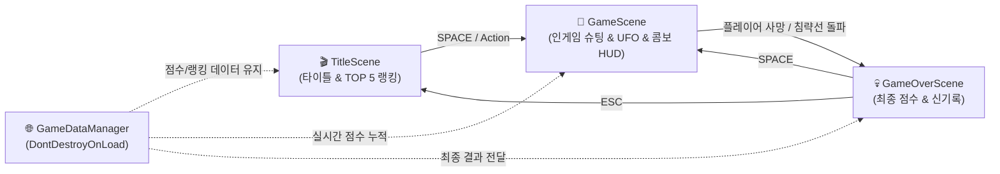

# 👾 Star Invader (Unity 6 2D Space Shooter)

<div align="center">

-blue.svg?style=for-the-badge&logo=unity)


<br>

**클래식 아케이드 감성의 스페이스 인베이더를 현대적인 Unity 6 컴포넌트 기반 아키텍처와 절차적 신스 오디오로 재해석한 2D 레트로 슈팅 게임입니다.**

</div>

---

## 👨‍💻 Developer Information

- **Name:** Baekjin Sung (성백진)
- **Role:** Passionate Software Engineer
- **Email:** [sbjwin4271@gmail.com](mailto:sbjwin4271@gmail.com)
- **GitHub:** [@sbjwin](https://github.com/sbjwin)

---

## 🎮 게임 주요 특징 (v0.2 Key Features)

**Star Invader**는 지구를 침략하려는 외계 편대(Alien Fleet)와 미스터리 모함의 공습을 저지하는 클래식 2D 아케이드 슈팅 게임입니다. 

* **🛸 상단 보너스 외계인 모함 (Mystery UFO):** 18~28초 주기로 화면 상단을 고속 횡단하는 보너스 UFO 출현. 전용 워블 사이렌 및 격추 시 500~1,500점 랜덤 대박 점수와 팡파레 SFX 제공.
* **🔥 연속 처치 점수 콤보 (Combo Multiplier):** 2초 이내 연속 격추 시 `COMBO x2` ~ `COMBO x5` 배율이 적용되어 박진감 넘치는 플레이 유도.
* **⚡ 피격 화이트 플래시 타격감 (Hit Flash):** 적 피격 시 0.06초간 눈부신 순백색으로 반짝이는 정통 아케이드 타격 피드백 연출.
* **👾 동기화된 적 편대 AI:** 3행 × 8열(총 24기)의 적들이 좌우로 이동하며 벽에 부딪힐 때마다 하강. 적 기체가 파괴될수록 편대 이동 속도가 가속.
* **최하단 적의 탄환 반격:** 각 열의 최하단에 위치한 적들이 주기적으로 네온 레드 펄스 레이저를 발사.
* **플레이어 라이프 & 무적 연출:** 시작 목숨 3개가 주어지며, 피격 시 화면 진동(`CameraShake`)과 1.2초간의 무적 깜빡임 연출 발동.
* **🔊 100% 절차적 신스 오디오 (Pure Synthesized SFX):** 외부 오디오 파일 없이도 플레이어 레이저, 적 펄스 레이저, 폭발음, 타격음, UFO 사이렌, 콤보 핑, 보너스 팡파레를 실시간 C# 수학 알고리즘으로 합성하여 완벽 재생.
* **🏆 로컬 JSON 랭킹 시스템:** 게임오버 시 최고 기록을 갱신하고 상위 TOP 5 점수를 로컬 JSON 파일에 영구 보존.

---

## 🕹️ 조작 방법 (Controls)

> **Unity 6 최신 New Input System 및 레거시 입력을 모두 완벽 지원합니다.**

| 키 (Key) | 기능 (Action) |
| :--- | :--- |
| **`A` / `D`** 또는 **`←` / `→`** | 플레이어 비행선 좌우 이동 |
| **`Space`** 또는 **`Enter`** | 타이틀 시작 / 레이저 탄환 발사 / 게임오버 시 재시작 |
| **`R`** | 타이틀 화면에서 TOP 5 랭킹 모달 열기 |
| **`ESC`** | 랭킹 창 닫기 / 게임오버 화면에서 타이틀 씬 복귀 |

### 🛠️ 개발자 디버그 & 상태 주입 하네스 (Harness Controls)

> **Unity Editor 및 Development Build 환경에서만 활성화되며, 최종 릴리즈 빌드 시 오버헤드 0B로 자동 완전 제외됩니다.**

| 단축키 (Hotkey) | 하네스 기능 (Action) |
| :--- | :--- |
| **`Tab`** | 화면 좌상단 온스크린 디버그 GUI 허브 창 열기/닫기 토글 |
| **`F1`** | 보너스 UFO 즉시 스폰 (워블 사이렌 & 보너스 팡파레 SFX 검증) |
| **`F2`** | 적 편대 최하단 침략선 강제 배치 (기지 돌파 게임오버 판정 검증) |
| **`F3`** | 플레이어 무적 모드 (God Mode) On/Off 토글 |
| **`F4`** | 점수 +10,000점 & 콤보 5배율(MAX) 강제 주입 |
| **`F5` / `F6`** | 플레이어 라이프 +1 추가 / -1 차감 (피격 연출 및 사망 검증) |
| **`F7`** | 적 편대 1기만 남기고 일괄 격추 (최종 이동 가속 상태 검증) |
| **`F8`** | 게임 배속 순환 제어 (1.0x → 2.0x → 5.0x → 10.0x) |
| **`F9`** | 다음 스테이지 강제 전환 (클리어 배너 & 1UP 보상 검증) |
| **상단 메뉴** | `Tools > StarInvader > Run Fast Smoke Test` (10배속 크래시 자동 감지) |


---

## 🏗️ 씬 구조 및 아키텍처 (Multi-Scene Architecture)

단일 씬의 단순 활성/비활성화 한계를 탈피하고, **책임 분리와 수명주기 관리가 명확한 유니티 표준 3단 멀티 씬 구조**로 설계되었습니다.



---

## 🚀 빠른 시작 가이드 (How to Clone & Run)

```bash
# 레포지토리 클론
git clone https://github.com/sbjwin/StarInvader.git
```

1. **Unity Hub**에서 `StarInvader` 프로젝트 폴더를 엽니다 (`Unity 6 (6000.3.22f1)` 권장).
2. **`Assets/Scenes/TitleScene.unity`**를 열고 상단의 **`▶ (Play)`** 버튼을 누릅니다.
3. **`Space`** 키를 눌러 출격합니다!

---

## 📁 프로젝트 폴더 구조

```text
StarInvader/
├── Assets/
│   ├── GameAssets/          # 스프라이트 이미지, 폰트, SFX 오디오
│   │   ├── images/
│   │   │   ├── background/  # 우주 배경, 로고
│   │   │   ├── effects/     # 플레이어/적 탄환, 폭발 스프라이트
│   │   │   ├── enemy/       # Top/Mid/Bottom/UFO/Boss 기체
│   │   │   ├── player/      # 플레이어 기체
│   │   │   └── ui/          # 네온 프레임 박스
│   │   └── sounds/
│   ├── Prefabs/             # 플레이어/적 탄환, 보너스 UFO, 폭발 이펙트 프리팹
│   │   ├── BonusUfo.prefab
│   │   ├── PlayerBullet.prefab
│   │   ├── EnemyBullet.prefab
│   │   └── ExplosionEffect.prefab
│   ├── Scenes/              # 3단 멀티 씬
│   │   ├── TitleScene.unity
│   │   ├── GameScene.unity
│   │   └── GameOverScene.unity
│   └── Scripts/             # 핵심 C# 스크립트
│       ├── BonusUfo.cs            # 상단 횡단 보너스 UFO 및 팡파레 연출
│       ├── BackgroundScroller.cs  # 우주 배경 무한 스크롤
│       ├── Bullet.cs              # O(1) 정적 카운터 기반 탄환 충돌 & 이동
│       ├── CameraShake.cs         # 피격 시 카메라 진동 연출
│       ├── Enemy.cs               # 개별 적 기체 피격 화이트 플래시 & 폭발
│       ├── EnemyFleet.cs          # 24기 편대 제어 & 사격 AI
│       ├── GameConstants.cs       # 게임 밸런스 상수 정의
│       ├── GameDataManager.cs     # 글로벌 싱글톤 점수/랭킹 매니저
│       ├── GameOverController.cs  # 게임오버 씬 제어
│       ├── InGameController.cs    # 콤보 배율, UFO 스폰, HUD 제어
│       ├── InputHelper.cs         # New/Old Input System 크로스 플랫폼 헬퍼
│       ├── PlayerController.cs    # 플레이어 이동, 사격, 무적 코루틴
│       ├── SoundManager.cs        # 100% 절차적 신스 오디오 매니저
│       ├── TitleController.cs     # 타이틀 씬 및 랭킹 모달 제어
│       └── Editor/                # 스프라이트/씬 자동 보정 툴
└── README.md
```

---

## 📜 라이선스 (License)

This project is licensed under the MIT License - see the [LICENSE](LICENSE) file for details.
